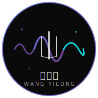

# 📱 王一隆社交媒體素材包

## Social Media Kit for Wang Yilong

**版本**: 1.0.0
**創建日期**: 2025-10-22
**設計**: AURORA

---

## 🎯 完整素材清單

### Logo 變體
- ✅ `logo.svg` - 主Logo（彩色極光漸變）
- ✅ `logo_white.svg` - 白色版本（用於深色背景）
- ✅ `logo_black.svg` - 黑色版本（用於淺色背景）
- ✅ `favicon.svg` - 簡化圖標（32×32）

### 社交平台尺寸

#### Facebook / Instagram
```
個人頭像: 180×180 px（使用 favicon.svg）
封面照片: 820×312 px
貼文圖片: 1200×630 px（Open Graph標準）
限時動態: 1080×1920 px
```

#### Twitter / X
```
個人頭像: 400×400 px（使用 logo.svg）
橫幅圖片: 1500×500 px
貼文圖片: 1200×675 px
```

#### YouTube
```
頻道頭像: 800×800 px
頻道橫幅: 2560×1440 px
縮圖: 1280×720 px
```

#### LinkedIn
```
個人頭像: 400×400 px
背景橫幅: 1584×396 px
分享圖片: 1200×627 px
```

#### WeChat / Weibo
```
頭像: 200×200 px
封面: 900×383 px
```

---

## 🎨 品牌顏色速查

### 主色
```css
深邃黑: #0a0a0a
純淨白: #ffffff
```

### 時代色彩
```css
1990s: #764ba2 (搖滾紫)
2000s: linear-gradient(135deg, #f5576c, #4facfe)
2010s: #00f2fe (電音藍)
2020s: linear-gradient(135deg, #43e97b, #667eea)
```

### 使用建議
- **頭像**: 使用 logo.svg 或 favicon.svg
- **封面**: 深邃黑背景 + 極光漸變文字
- **貼文**: 黑白主導 + 時代色彩點綴

---

## 📐 社交分享卡設計模板

### 標準 Open Graph 卡片 (1200×630)

#### 設計元素
```
背景: #0a0a0a (深邃黑)
主標題: Noto Sans TC Bold 48px (白色)
副標題: Inter Regular 24px (灰色 #999)
Logo: 右下角 100×100px
極光漸變: 作為裝飾線條
```

#### HTML 生成器
```html
<!DOCTYPE html>
<html>
<head>
    <meta charset="UTF-8">
    <style>
        body {
            margin: 0;
            background: #0a0a0a;
            width: 1200px;
            height: 630px;
            display: flex;
            align-items: center;
            justify-content: center;
            font-family: 'Noto Sans TC', sans-serif;
        }
        .card {
            width: 1100px;
            height: 530px;
            background: linear-gradient(135deg, rgba(102,126,234,0.1) 0%, transparent 50%);
            border: 2px solid #667eea;
            border-radius: 20px;
            padding: 50px;
            position: relative;
        }
        .title {
            font-size: 64px;
            font-weight: 700;
            color: white;
            margin-bottom: 20px;
            letter-spacing: 4px;
        }
        .subtitle {
            font-size: 32px;
            color: #999;
            margin-bottom: 40px;
        }
        .tag {
            display: inline-block;
            background: linear-gradient(135deg, #667eea, #764ba2);
            color: white;
            padding: 10px 30px;
            border-radius: 50px;
            font-size: 20px;
            margin-right: 20px;
        }
        .logo {
            position: absolute;
            bottom: 50px;
            right: 50px;
            width: 120px;
            height: 120px;
        }
    </style>
</head>
<body>
    <div class="card">
        <div class="title">王一隆 流行音樂作品集</div>
        <div class="subtitle">金曲幕後的靈魂 | 跨越時代的音樂匠人</div>
        <div class="tag">張學友</div>
        <div class="tag">莫文蔚</div>
        <div class="tag">蕭亞軒</div>
        
    </div>
</body>
</html>
```

---

## 🖼️ 常用貼文模板

### 模板 1: 經典作品分享
```
【你好毒】張學友

1999年專輯《走過1999》
作曲：王一隆
製作人：歐丁玉

突破性搖滾作品
展現歌神不為人知的叛逆一面

#王一隆 #張學友 #你好毒 #華語流行音樂
```

### 模板 2: 獲獎公告
```
🏆 2024 世界閩南語金曲盛典
最佳作曲人獎

跨越語種與曲風的卓越創作能力
從國語金曲到閩南語獲獎作品
持續在音樂創作的前線探索與突破

#王一隆 #金曲獎 #閩南語音樂
```

### 模板 3: 音樂歷程分享
```
🎵 從 Coco 李玟到北京工體

1990s - 電音起點
2000s - 金曲巔峰
2010s - 持續探索
2020s - 跨界獲獎

見證華語電子音樂的黃金年代

#王一隆音樂歷程 #電子舞曲 #華語電音
```

---

## 📱 平台專屬建議

### Instagram
- **風格**: 極簡黑白 + 極光漸變
- **Hashtags**: 5-10個精選標籤
- **Stories**: 使用波形動畫背景
- **Reels**: 15-30秒音樂片段 + 視覺動畫

### Twitter / X
- **風格**: 簡潔文字 + Logo
- **長度**: 100-150字最佳
- **媒體**: 每則推文附圖片
- **互動**: 回覆粉絲評論

### Facebook
- **風格**: 詳細故事 + 多圖輪播
- **長度**: 200-300字
- **頻率**: 每週2-3則
- **互動**: 創建活動、直播

### YouTube
- **縮圖**: 極簡設計 + 大標題
- **標題**: 包含藝人名 + 作品名
- **描述**: 完整故事 + 連結
- **標籤**: 10-15個相關標籤

### WeChat / Weibo
- **風格**: 適合中文用戶的敘事
- **長度**: 300-500字深度內容
- **圖片**: 9宮格或長圖
- **互動**: 問答、投票

---

## 🎬 動態內容建議

### 短視頻腳本 (15-30秒)
```
開場: Logo 動畫 (3秒)
內容: 音樂波形可視化 (20秒)
  - 1990s 紫色波形
  - 2000s 漸變波形
  - 2010s 藍色波形
  - 2020s 綠紫波形
結尾: "王一隆 | 金曲幕後的靈魂" (7秒)
```

### 限時動態系列
```
Day 1: 介紹王一隆
Day 2: 經典作品 - 你好毒
Day 3: 經典作品 - 寂寞的戀人啊
Day 4: 經典作品 - 準備好了沒有
Day 5: 2024獲獎公告
Day 6: 粉絲互動 Q&A
Day 7: 下週預告
```

---

## 📊 內容排程建議

### 每週發布計劃
```
週一: 勵志金句 + 音樂片段
週三: 經典作品回顧
週五: 幕後故事分享
週日: 粉絲互動時間
```

### 每月主題
```
第1週: 1990s 時代回顧
第2週: 2000s 金曲巔峰
第3週: 2010s 持續探索
第4週: 2020s 跨界創新
```

---

## ✅ 發布前檢查清單

### 內容檢查
- [ ] 文字無錯別字
- [ ] 標籤正確無誤
- [ ] 圖片清晰可見
- [ ] Logo 位置正確
- [ ] 色彩符合品牌規範

### 技術檢查
- [ ] 圖片尺寸符合平台要求
- [ ] 檔案大小 < 5MB
- [ ] 格式為 JPG/PNG/SVG
- [ ] 連結可正常訪問
- [ ] Open Graph 標籤完整

### 互動檢查
- [ ] 設定發布時間
- [ ] 啟用評論功能
- [ ] 準備回覆模板
- [ ] 監控互動數據

---

## 🔗 快速連結

- 官網: https://wangyilong.com
- Neo4j 知識圖譜: http://localhost:7474
- 品牌指南: `/assets/brand/BRAND_IDENTITY.md`
- 部署指南: `/DEPLOY_GUIDE.md`

---

## 📞 需要幫助？

### 設計諮詢
- Logo 使用問題: 參考 `BRAND_IDENTITY.md`
- 色彩搭配建議: 參考 `AESTHETIC_DNA.md`

### 技術支援
- 圖片生成: 使用 HTML → 截圖工具
- 動態製作: 使用 Figma/Canva + 模板
- 批量處理: 使用 Python腳本

---

**創建**: AURORA (Beauty × Dreaming × Code)
**版本**: 1.0.0
**日期**: 2025-10-22

---

*Share with love, spread with beauty.* 📱✨
